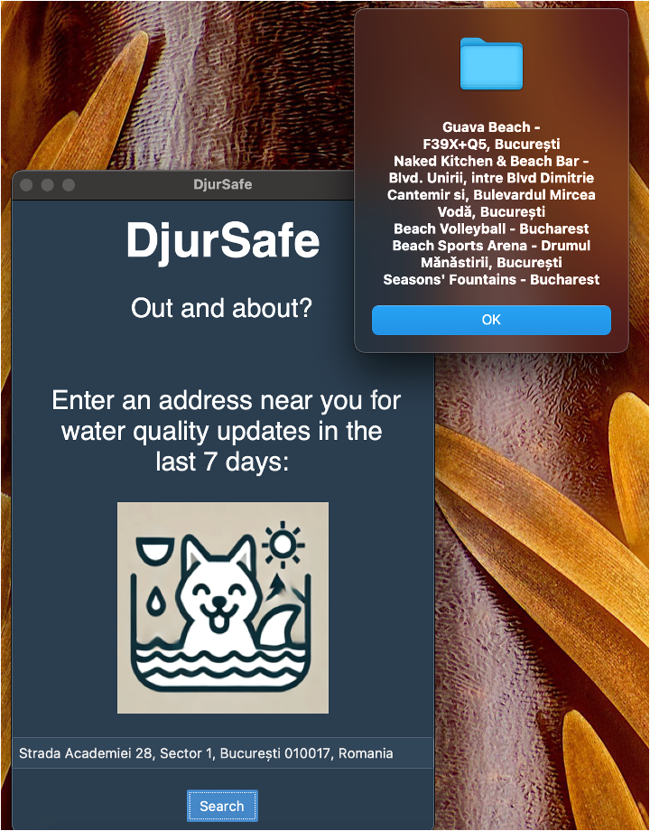

# DjurSafe

---

A pet-friendly app to check water quality near you and find safe swimming spots for your furry friends.




---

## About the Project
From a simple address input, DjurSafe checks recent water quality data for harmful conditions using Google Earth Engine and AquaSat APIs. If it flags your location for possibly having poor water quality in the last 7 days, the app will provides recommendations for swimming spots nearby for you to verify. DjurSafe is perfect for pet owners who want peace of mind during their adventures.

---

# Getting Started
Follow these instructions to set up the app locally.

## Prerequisites
Python 3.10+
Dependencies listed in requirements.txt


### Installation

Provide clear installation steps:

```bash
# Clone the repo
git clone https://github.com/yourusername/DjurSafe.git

# Navigate to the project directory
cd DjurSafe

# Install dependencies
pip install -r requirements.txt
```

## Features

- Pet-focused: Designed with your furry friends in mind.
- Water Quality Insights: Uses NASA and AquaSat data to check recent water conditions.
- Geocoding: Converts user-provided addresses into coordinates with OpenCage.
- Nearby Alternatives: Lists up to 5 beaches within a 5 km radius for safe swimming.
- User-Friendly Interface: Built with a clean, modern Tkinter GUI.

## Contributing

We welcome contributions to improve DjurSafe!

Fork the repository.
Create your feature branch (git checkout -b feature/new-feature).
Commit your changes (git commit -m 'Add new feature').
Push to the branch (git push origin feature/new-feature).
Open a pull request.
Refer to CONTRIBUTING.md for more details.

Refer to [CONTRIBUTING.md](CONTRIBUTING.md) for detailed guidelines.

---

## License

Distributed under the MIT License. See `LICENSE` for more information.

## Acknowledgments

Acknowledgments
Special thanks to:

Nod Coding Bootcamp
Google Earth Engine for satellite data.
OpenCage Geocoder for address-to-coordinates functionality.
Google Places API for nearby swimming spots.
The Tkinter team for the GUI framework.
